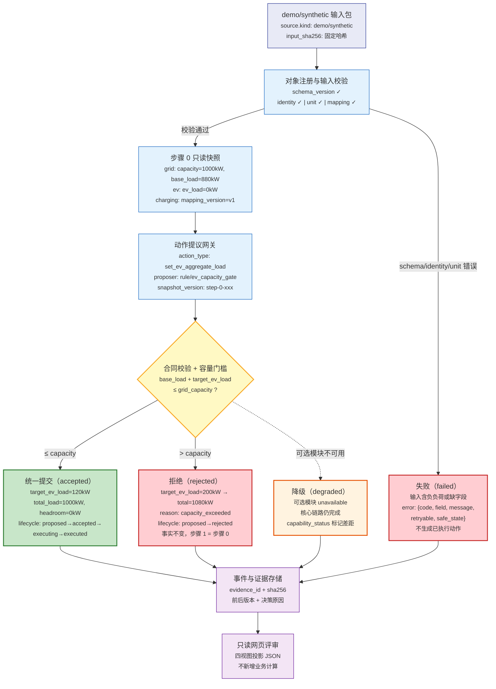

# EV 场景数据流图

> 版本：v0.1 experimental | 场景：EV 承载力提升 | 数据来源：`run-accepted.json`, `run-rejected.json`
>
> 覆盖 accepted、rejected、degraded 三类路径。

## 路径说明

| 路径 | 触发条件 | 步骤 1 事实 | 运行状态 |
|------|---------|------------|---------|
| accepted | `base_load + target_ev_load ≤ capacity` | 提交新负荷 | `accepted` |
| rejected | `base_load + target_ev_load > capacity` | 与步骤 0 相同 | `rejected` |
| failed | 输入非法（负负荷、缺字段、schema 不兼容） | 无快照生成 | `failed` |
| degraded | 可选模块 `unavailable`，核心链路可继续 | 标记差距后提交 | `degraded` |

## 字段来源

所有图中字段均可回链到 `schemas/run-record.schema.json` 和 `module-manifest.json`：
- `capacity_kw`, `base_load_kw`, `total_load_kw`, `headroom_kw` → field_group `grid`
- `ev_load_kw`, `target_ev_load_kw` → field_group `ev-traffic`
- `action_type`, `lifecycle`, `parameters` → field_group `action`
- `rule_id`, `outcome`, `reason_code` → field_group `safety-and-commit`
