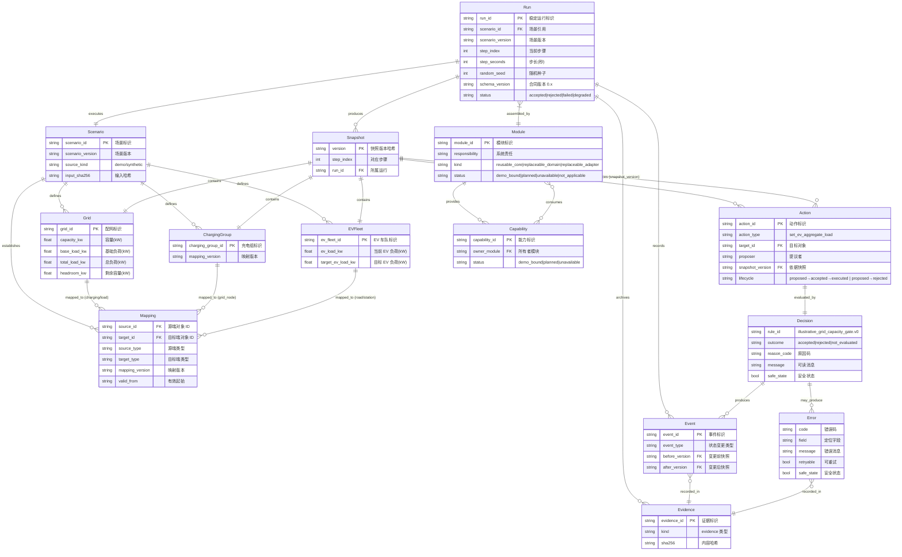

# EV 场景实体关系图

> 版本：v0.1 experimental | 场景：EV 承载力提升 | 数据来源：`run-record.schema.json`, `module-manifest.json`
>
> 覆盖 Run、Scenario、Grid、EVFleet、ChargingGroup、Mapping、Snapshot、Action、Decision、Event、Error、Evidence、Module、Capability。

## 实体说明

| 实体 | 唯一标识 | 所有者模块 | 来源 |
|------|---------|-----------|------|
| Run | `run_id` | scenario-manager | run-record.schema.json |
| Scenario | `scenario_id` + `scenario_version` | scenario-manager | run-record.schema.json |
| Grid | `grid_id` | grid-twin | field_group `grid` |
| EVFleet | `ev_fleet_id` | ev-traffic-twin | field_group `ev-traffic` |
| ChargingGroup | `charging_group_id` | charging-twin | field_group `charging` |
| Mapping | `source_id` + `target_id` + `mapping_version` | object-registry | field_group `charging` + 跨域映射 |
| Snapshot | `version` (哈希) | runtime-orchestrator | run-record `snapshots` |
| Action | `action_id` | proposal-gateway | field_group `action` |
| Decision | 内嵌于 Action 结果 | safety-transaction | field_group `safety-and-commit` |
| Event | `event_id` (隐含) | evidence-storage | run-record `evidence` |
| Error | 内嵌于运行结果 | 各生产者 | run-record `errors` |
| Evidence | `evidence_id` | evidence-storage | run-record `evidence` |
| Module | `module_id` | contract-registry | module-manifest.json |
| Capability | `capability_id` | contract-registry | module-manifest `provides`/`consumes` |

## 追踪

- Action 可回查 Snapshot（`snapshot_version`）、目标对象（`target_id`）和 Decision
- Decision 可回查 Event/Error 和 Evidence
- Evidence 包含 `sha256` 用于可复现校验
- 其他场景（如分布式新能源）实体标记为 `planned`，本图不展开未批准字段
