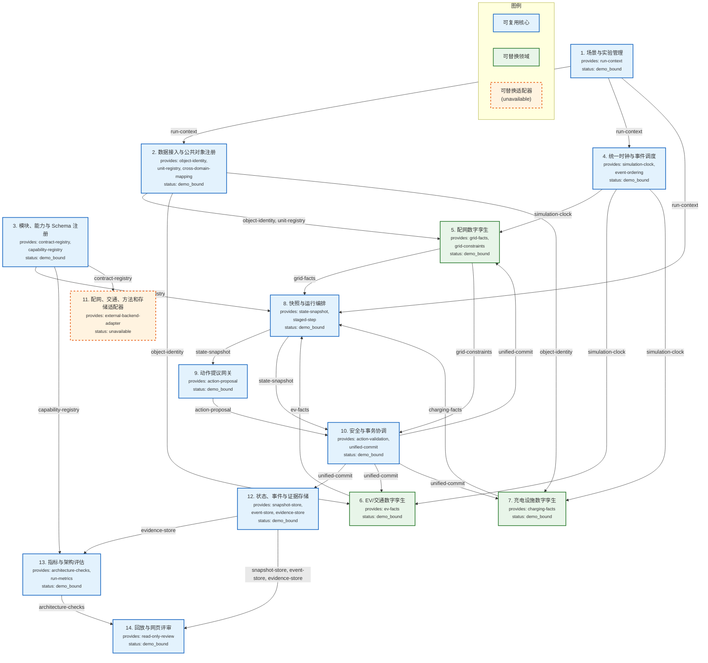

# EV 场景模块交互图

> 版本：v0.1 experimental | 场景：EV 承载力提升 | 数据来源：`module-manifest.json`
>
> 制图不重新设计公共合同；仅对已批准架构的视觉表达。

## 说明

- 箭头标注的是**能力名称**（provides → consumes 方向）
- 模块编号与 `module-manifest.json` 一致
- 所有模块当前状态为 `demo_bound`（仅 #11 为 `unavailable`）
- 本图不画成 14 个微服务；边界通过合同和依赖方向保持
