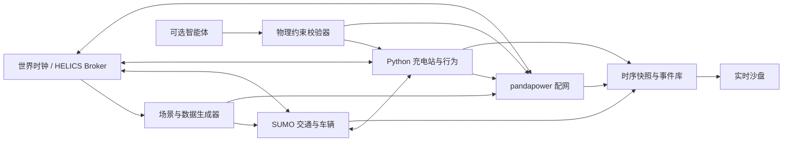

# 车-路-站-网“世界模型”可落地途径调研报告

> 文档状态：技术调研输入。工具采用决定须通过对应 OpenSpec change 的实测、Review 与验收，本文中的推荐组合不等同于最终选型结论。

## 1. 概念与项目边界

本项目中的“世界模型”不是用神经网络生成下一帧状态，也不是把大语言模型放入物理主循环，而是一个能够脱离智能体持续运行的虚拟车-路-站-网环境。

环境自身具备：

- 仿真时钟、状态和确定性回放；
- 车辆出行、交通流、SOC、排队、充电和配网状态演化；
- 历史模板叠加可复现随机扰动的数据生成能力；
- 在没有智能体时仍可工作的基线规则控制器；
- 对外提供状态、事件、策略建议和物理校验接口。

该定义与现有“孪生体掌握事实、智能体掌握策略”的 T 型架构一致，并可支撑任务书提出的连续 `24×7` 小时仿真推演。

## 2. 工具路线对比

| 工具 | 适合承担的职责 | 优点 | 主要限制 | 结论 |
|---|---|---|---|---|
| HELICS | 联合仿真时钟、跨进程消息与联邦管理 | 面向能源系统联合仿真；时间同步和分布式扩展能力强 | 首期开发和部署复杂度高于单进程 Python | 作为阶段三首选编排器 |
| mosaik | 多模型场景编排 | Python 友好；智能电网场景搭建直接 | 实时交互、跨机器和动态联邦能力相对弱 | 作为教学及快速联合仿真备选 |
| SUMO | 车辆、道路、路径与充电行为 | 交通微观仿真成熟；TraCI 可在线控制 | 需要将现有抽象 32 节点路网转换为 SUMO 网络 | 作为阶段二交通求解器 |
| pandapower | 配网潮流、控制和时序计算 | Python 生态成熟；潮流、OPF、短路和时序功能齐全 | 不负责交通、车辆和事件编排 | 作为阶段二配网求解器 |
| GridLAB-D / OpenDSS | 配电系统精细时序与设备模型 | 工程模型丰富 | 接入成本、模型准备和跨平台部署成本更高 | 后续高保真校核选项 |
| 自研 Python 内核 | 首期业务闭环和接口验证 | 零额外依赖；可直接复用现有拓扑和规则 | 当前配网模型是筛查级近似，不能替代正式潮流 | 作为阶段一已实现方案 |

推荐组合为 `HELICS + SUMO + pandapower + Python 站点/行为模型`。不采用单一工具包办全部领域，而由 HELICS 同步各专业求解器。

## 3. 推荐架构

智能体断开时，由基线控制器继续执行 Markov 出行、最短路、SOC 阈值、站点成本排序和分时电价。智能体只能提交候选动作，动作经过约束校验后才可影响世界。

## 4. 数据生成与场景

首期以现有拓扑和研究模型为基座，使用日内曲线生成交通需求、基础负荷、光伏、风电和电价节律，并由固定随机种子生成个体差异。后续接回原始 `.npy/.xlsx` 数据时，仅替换数据源，不改变世界主循环。

必须覆盖六类验收场景：

1. 正常工作日；
2. 晚高峰；
3. 充电需求激增；
4. 充电站故障；
5. 新能源骤降；
6. 配网节点电压越限。

事件均需要记录开始时间、结束时间、作用对象、参数和随机种子，保证实验可重演。

## 5. 分阶段实施

### 阶段一：可运行业务原型

已实现单进程 Python 内核、SQLite 轨迹存储、基线策略、六类事件、实时 API、Web 沙盘和确定性回放。该阶段用于确认业务链和接口，不声称达到电力工程高保真。

### 阶段二：专业求解器替换

- 将 32 节点交通拓扑转成 SUMO 网络并通过 TraCI 驱动车辆；
- 将 24 节点配网参数补齐后交由 pandapower 执行潮流；
- 使用同一套交换对象保持 UI、数据库和智能体接口不变；
- 用现有历史结果校准交通流、站点负荷、电压和排队分布。

### 阶段三：HELICS 联邦化

将交通、站点、配网、数据生成器和记录器拆成独立 federate，统一管理时间申请、发布订阅、超时和故障检测，并支持跨机器部署。

### 阶段四：智能体与安全校验

开放策略插槽，进行智能体/基线 A-B 对比；所有动作经过数据一致性、时间同步、SOC、站点容量、电压和线路约束校验。智能体不可用时自动回退基线控制器。

## 6. 风险与工作量判断

- **最大数据风险**：当前本地交付物不含原始 `.npy/.xlsx` 数值数据。原型可运行，但正式校准前必须找回这些数据。
- **最大模型风险**：抽象 24 节点拓扑缺少完整额定电压、线路容量、变压器等参数，接入 pandapower 前需补齐。
- **最大集成风险**：SUMO 秒级步长和配网分钟级步长不同，需要由 HELICS 明确同步与聚合规则。
- **最大验收风险**：连续运行不等于可信。除不崩溃外，还需验证能量守恒、SOC 边界、队列容量和潮流约束。

按 2-3 名开发/研究人员估算：阶段一约 2-3 周，阶段二约 4-6 周，阶段三约 3-5 周，阶段四随智能体范围另行评估。

## 7. 建议结论

近期不应投入“生成式世界模型”训练。最稳妥路线是先建立可解释、可复现、可持续运行的联合仿真世界，再让智能体作为受约束的可插拔控制器进入。现有 EV 研究链条与拓扑资产足以启动阶段一，但专业求解器接入前必须补齐原始数据与配网工程参数。

## 参考工具

- HELICS: <https://docs.helics.org/en/latest/>
- mosaik: <https://mosaik.readthedocs.io/en/latest/>
- pandapower 时序仿真: <https://pandapower.readthedocs.io/en/latest/timeseries.html>
- SUMO: <https://sumo.dlr.de/docs/>
